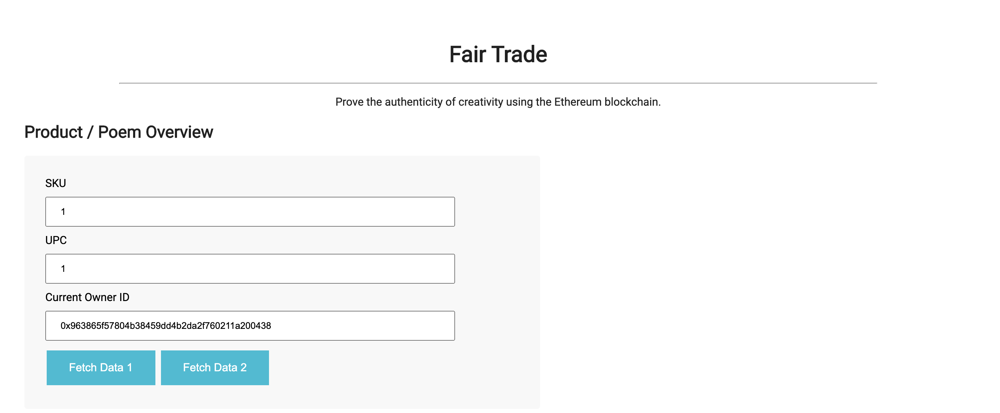
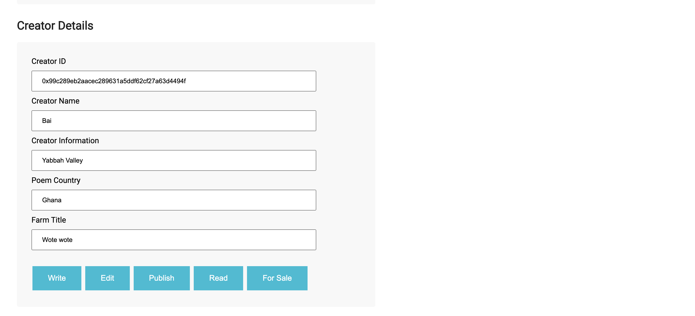
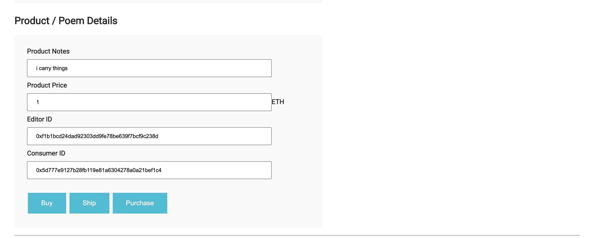
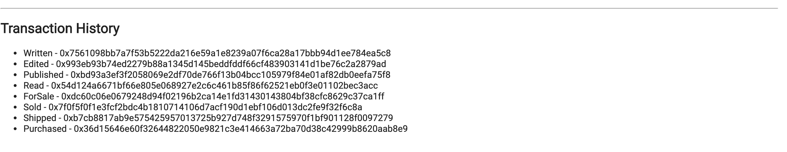
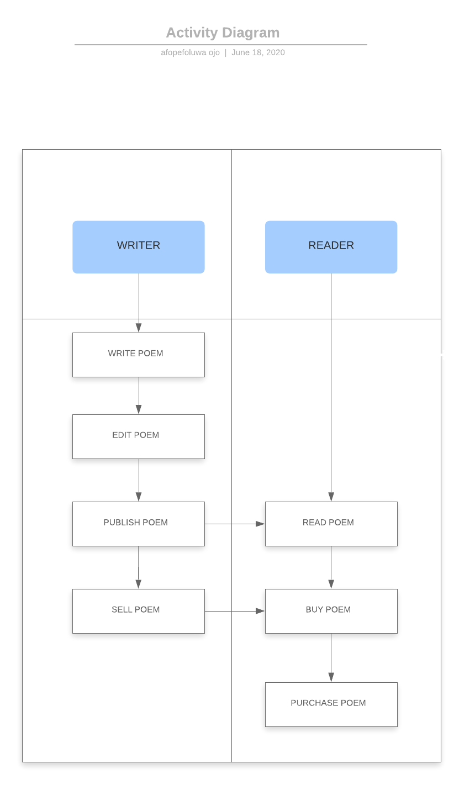
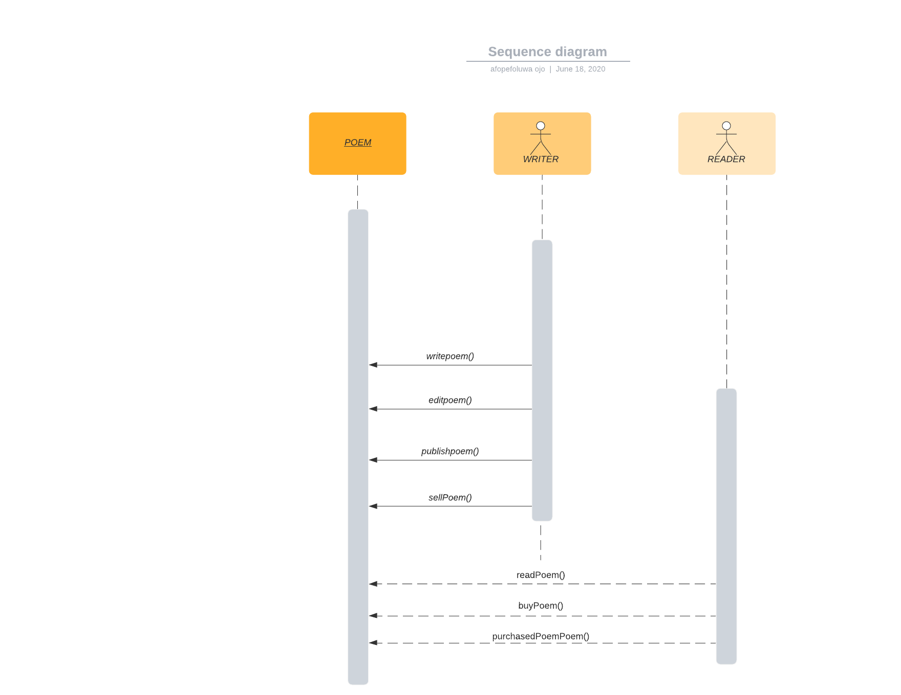
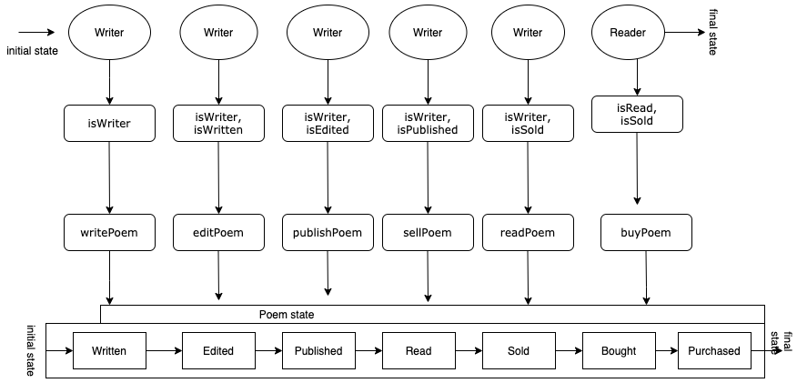
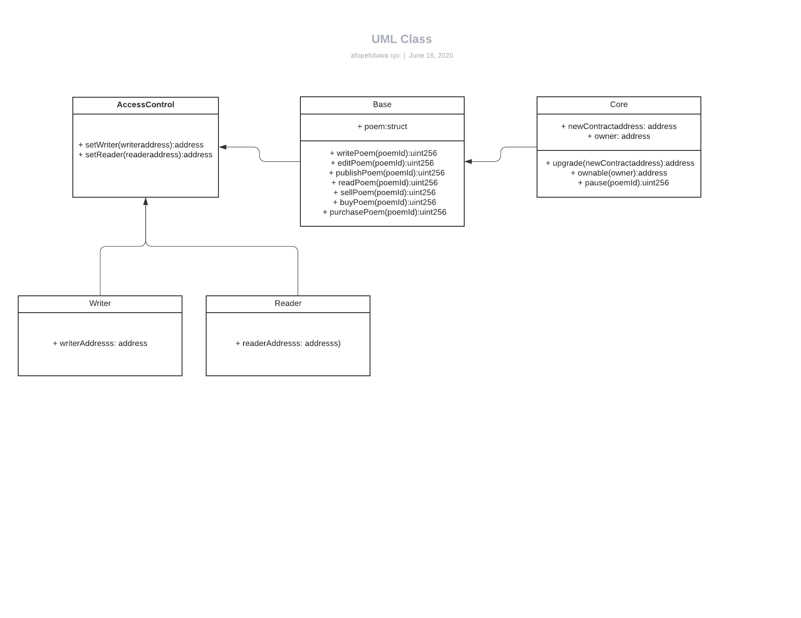

# Fair Trade Dapp

## General Overview

This repository containts an Ethereum DApp that demonstrates a Supply Chain flow between a Seller and Buyer. The user story is similar to any commonly used supply chain process. A Seller can add items to the inventory system stored in the blockchain. A Buyer can purchase such items from the inventory system. Additionally a Seller can mark an item as Shipped, and similarly a Buyer can mark an item as Received.

The Fair Trade dapp is a decentralized application built on the Ethereum blockchain using Truffle and Web3. The smart contract is written with solidity and deployed on the Rinkeby Test Network with contract address: **x347981e60874eAbc709C04826735906B08D59bc0**.

The dapp is a supply chain that allows creators (represented as “writer”) create items and put them up for sale so that consumers can experience and also purchase. It is an archival project that allows for buying and selling so that every item created is represented as a “poem”. There are three access roles included, which are: CreatorRole, EditorRole, and ConsumerRole, and they are allowed to access various functions throughout the supply chain. The OwnableRole.sol found in the coffecore folder, manages ownership and transfer of ownership.  

The following steps exist in this supply chain and the following user roles are allowed to access them. 

* WriteItem (onlyCreator)
* EditItem (onlyEditor)
* PublishItem(onlyCreator)
* ReadItem (onlyConsumer)
* SellItem (onlyCreator)
* ShipItem (onlyCreator)
* BuyItem (onlyConsumer)
* PurchaseItem (onlyConsumer)


The DApp User Interface when running should look like...








 
 ## UML Diagrams

Below you will find the activity diagram, sequence diagram, state diagram, and UML class diagram. You will also find the libraries used for the project and what they’re used for.









## Libraries Used


* [Ethereum](https://www.ethereum.org/) - Ethereum is a decentralized platform that runs smart contracts
* [IPFS](https://ipfs.io/) - IPFS is the Distributed Web | A peer-to-peer hypermedia protocol
to make the web faster, safer, and more open.
* [Truffle Framework](http://truffleframework.com/) - Truffle is the most popular development framework for Ethereum with a mission to make your life a whole lot easier.
* [Web3](https://web3js.readthedocs.io/en/v1.2.9/): WEB3 is a collection of libraries that allows our Fair Trade dapp to interact with local or remote ethereum node through http connection. 


## Getting Started

These instructions will get you a copy of the project up and running on your local machine for development and testing purposes. See deployment for notes on how to deploy the project on a live system.

To run this app, after cloning it from the repository on github and then cd into project-6. In project 6, you can run the contract by running `truffle compile` and run tests by running, `truffle test`. To run the frontend of the dapp, which is written in node, run `npm dev` in your terminal. See below for detailed guide on how to setup project. 


### Prerequisites

Please make sure you've already installed ganache-cli, Truffle and enabled MetaMask extension in your browser.

```
Give examples (to be clarified)
```

### Installing

A step by step series of examples that tell you have to get a development env running

Clone this repository:

```
git clone https://github.com/udacity/nd1309/tree/master/course-5/project-6
```

Change directory to ```project-6``` folder and install all requisite npm packages (as listed in ```package.json```):

```
cd project-6
npm install
```

Launch Ganache:

```
ganache-cli -m "spirit supply whale amount human item harsh scare congress discover talent hamster"
```

Your terminal should look something like this:


In a separate terminal window, Compile smart contracts:

```
truffle compile
```

Your terminal should look something like this:


This will create the smart contract artifacts in folder ```build\contracts```.

Migrate smart contracts to the locally running blockchain, ganache-cli:

```
truffle migrate
```

Your terminal should look something like this:


Test smart contracts:

```
truffle test
```

All 10 tests should pass.


In a separate terminal window, launch the DApp:

```
npm run dev
```

## Acknowledgments

* Solidity
* Ganache-cli
* Truffle
* IPFS
